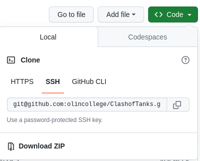
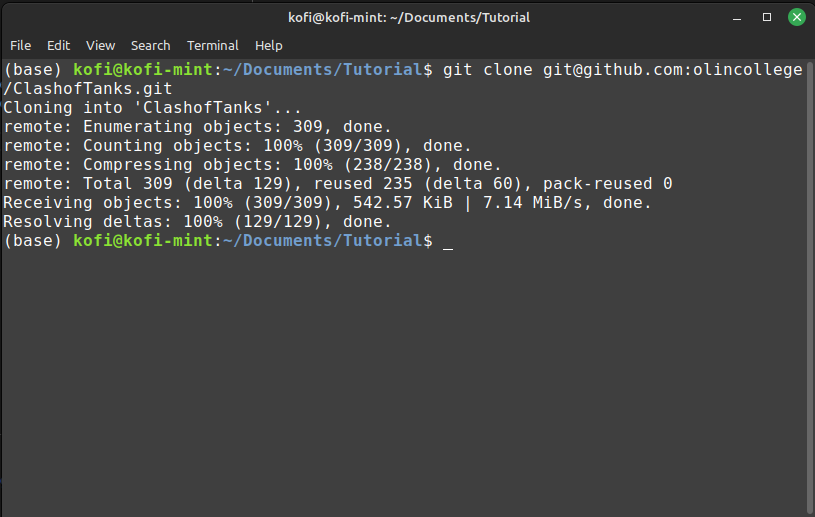
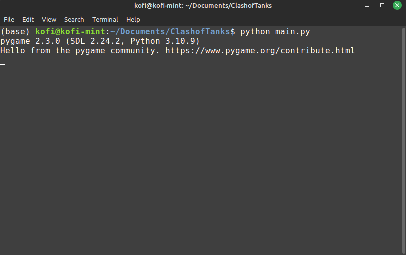
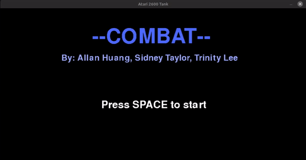

Thanks for opting to try our game! Playing games from a Github repo isn't as easy as playing them on a web browser, so we have provided some instructions on how to play below.

### Forking the repo
To get started, you will need to fork the repository. You can do this by navigating to the [project page](https://github.com/olincollege/ClashofTanks) and clicking the green "Code" button.

Copy this link and open a new terminal window. Type `git clone URL` replacing URL with the URL you just copied. If you normally keep cloned repositories in a specific folder, be sure to use the `cd` command to move into that directory before using `git clone`. If everything worked well, you should see the following:

### Installing the required libraries
to play our game, there is only one new library that you will need to install. The [pygame](https://pygame.org/news) library makes game development on Python much easier, and luckily it is very easy to install.

Assuming you installed Python and are using the conda-based environment from Anaconda, you can simply use the pip package manager to install pygame.

`pip install pygame`

This will install the pygame library required to play the game.

### Thats it!
If you went through the above steps correctly, you should be able to navigate to the ClashofTanks repo you cloned and run `python main.py` to play the game.

\

<small><em>Note: If you encounter any bugs during this process, make sure to check the [Bug Fixes](https://olincollege.github.io/ClashofTanks/blog/) page, as we may have already covered how to solve it. If we haven't covered it, you can report the issue [here](https://olincollege.github.io/ClashofTanks/bugs/) and we will do our best to find a fix and post it to the bug fixes page.</em></small>